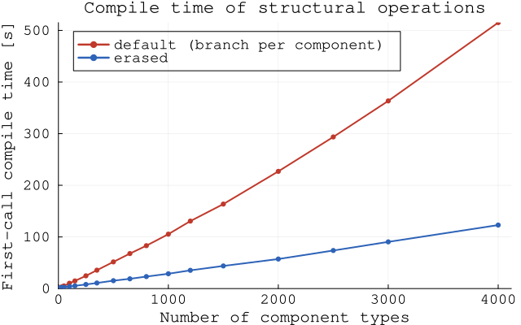
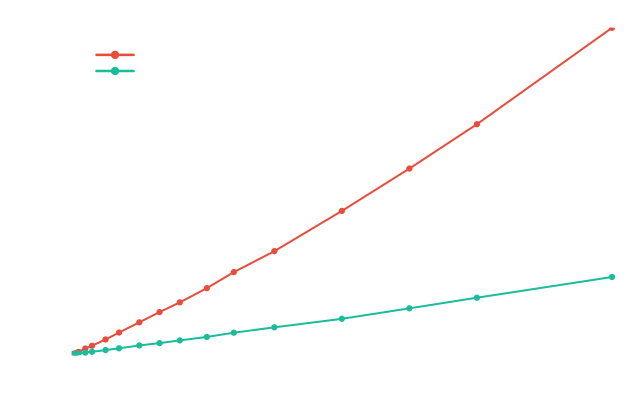

# The World

A [World](@ref world-api) is the central data store for any application that uses Ark.jl.
It manages [Entities](@ref), [Components](@ref) and [Resources](@ref),
and all these are always tied to a World.

Most applications will have exactly one world, but multiple worlds can exist at the same time.

## World creation

When creating a new world, all [Component types](@ref Components) that can exist in it must be specified.

```jldoctest world; output = false
using Ark

struct Position
    x::Float64
    y::Float64
end

struct Velocity
    dx::Float64
    dy::Float64
end

world = World(Position, Velocity)

# output

World(entities=0, comp_types=(Position, Velocity))
```

This may seem unusual, but it allows Ark to leverage Julia's compile-time programming
features for the best performance.

## Initial capacity

The [World constructor](@ref World(::Type...)) takes an option keyword argument `initial_capacity`
to allocate memory for the given number of [entities](@ref Entities) in each [archetype](@ref Architecture).
This is useful to speed up entity creations by avoiding repeated allocations.

```jldoctest world; output = false
world = World(Position, Velocity; initial_capacity=1024)

# output

World(entities=0, comp_types=(Position, Velocity))
```

## Type-erased dispatch

Ark resolves the component of a structural operation at compile time, by generating one
branch per component type. This is what makes structural operations fast, but the size of
the generated code grows with the number of component types a world declares, and so does
the time spent compiling it.

For worlds with many component types, the keyword argument `erased` routes those operations
through type-erased calls instead. The generated code then no longer depends on the number
of component types, and each per-component call is compiled only when it is first used.

```jldoctest world; output = false
world = World(Position, Velocity; erased=true)

# output

World(entities=0, comp_types=(Position, Velocity))
```

The effect grows with the number of component types: the default dispatch compiles
super-linearly, while the erased dispatch stays close to linear.

```@raw html


```
*First-call compile time of the structural operations as the number of component types grows
(world construction is excluded, since it is identical in both modes). Below a few dozen
component types the erased dispatch is slightly slower to compile; above that its advantage
widens quickly.*

This is a trade-off, not a free improvement:

  - Compilation cost of structural operations grows super-linearly with the number of
    component types in the default dispatch, but stays close to linear when erased. The mode
    pays off for worlds with a few dozen component types and above.
  - Structural operations on individual entities (adding and removing components, creating
    and removing entities, copying entities, shuffling) become roughly 2x slower.
  - Queries, batch operations and sorting are unaffected, as they operate per archetype
    column rather than per entity.

Leave the mode off unless compile time is a problem, and measure both before committing to it.

## World reset

Ark's primary goal is to empower high-performance simulation models.
In this domain, it is common to run large numbers of simulations, whether to explore model stochasticity,
perform calibration, or for optimization purposes.

To maximize efficiency, Ark provides a [reset!](@ref) function that resets a simulation world for subsequent reuse.
This significantly accelerates model initialization by reusing already allocated memory and avoiding costly reallocation.

```jldoctest world; output = false
reset!(world)

# output

```

## World functionality

You will see that almost all methods in Ark's API take a World as their first argument.
These methods are explained in the following chapters.
